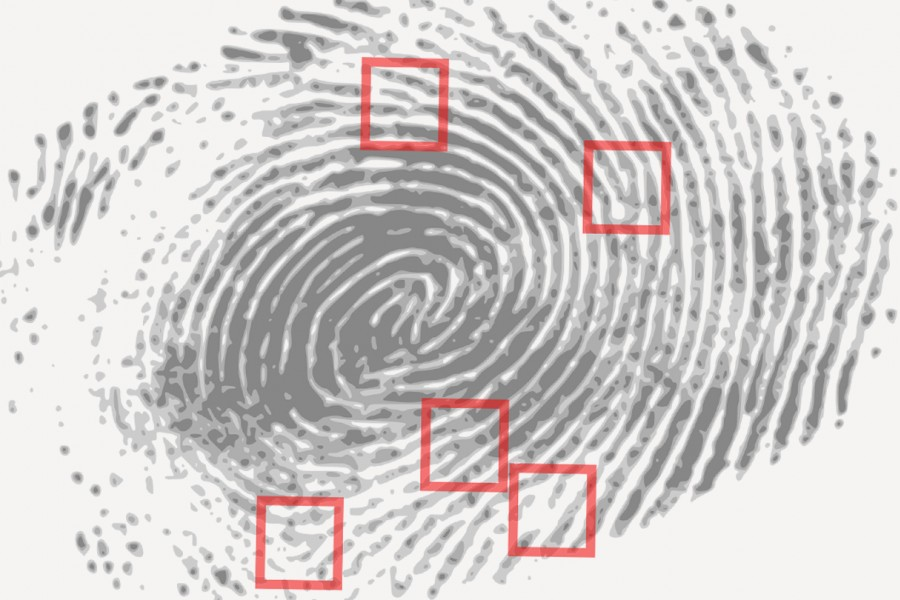

# Introduction

This course broadly approaches the issue of fairness in algorithmic
decision making for the *practicing data scientists*. We emphasize
reasoning about data-driven (algorithmic) decision making and its
interaction with society. This ability to reason helps the data
science practitioner engage in productive discussion with those their
models affect, ultimately resulting in more people benefiting from
the work.

One increasingly popular approach to studying fairness in the
application of statistical models to algorithmic decision making is to
fix an observable, quantitative notion of fairness and treat that
quantity as a constraint to include when fitting the model. This
approach intends to 'fix' algorithmic bias. While such observational
notions of fairness are useful for identifying differences between
groups in collected data, it misses much: Who is missing from the
data? Why do such differences exist? Are there other groups that need
simultaneous consideration? Are there other notions of fairness that
need simultaneous consideration? Is how the model's output used fair?
The course aims to empower the data scientist to holistically
discuss their data-driven systems and how it interacts with the
populace it affects. This way, the data scientist can represent their
work and how it's used in the public sphere -- and do their best for
their fellow human beings.

The topics covered in the course consist of:
1. An overview of concepts related to fairness (such as equality,
   justice, bias, and discrimination) and the contexts under which
   those concepts are considered (such as legal or social).
2. Discussion of measurement and data collection and its relationship
   to concepts of power.
3. Approaches to identifying existing (various notions of) inequity
   in data, while probing the limits to these approaches. Such
   approaches include using parity measures for measuring
   discrepancies across groups, causal models, and individual
   comparisons.
4. A close examination of how unfairness may appear across a typical
   machine learning pipeline.
5. Understanding ways in which the decision making process transforms
   a model into a generative process with long term effects like
   feedback loops. 
6  Applying the analysis of feedback loops to matching in online
   markets (Ad serving, gig economy, recommendations).
7. Approaching the problem of fairness in "decision agnostic" models
   that are later used in unforeseen ways (e.g. vector embedding, 3rd
   party APIs).
   
## Decisions informed by data

What is algorithmic decision making? In practice, it's an automated
scheme for making decisions *using data*. Policy makers, with help
from researchers in the social sciences, humanities, and sciences,
have been making decisions informed by data for centuries. Thus, in
order to study fairness in algorithmic decision making, we should
first examine how people make decisions informed by data and the ways
in which those decisions affect the fairness of the outcomes.

The first half of the course studies frameworks for understanding
concepts related to fairness, identifying inequities in data, and
examining when those inequities may have resulted from policy
decisions. We will draw on work from Philosophy, Sociology, Economics,
and Computer Science. While identifying and explaining inequity in
observed data is more general than the study of fairness in
algorithmic decisions, it's a necessary first step before going on to
examine the added dynamics that algorithmic decisions bring to the
problem.

The ability of a data scientist to surface inequities in the data they
study is not only necessary for understanding the consequences of
their (algorithmic) decisions, it's also a super-power waiting to be
used for good. Such studies raise awareness of inequities, help build
movements demanding change, and aid your fellow humans in bettoring
their lives.

### Algorithmic decisions

What is the difference between an algorithmic decision and a
traditional decision?

An algorithm is merely a set of rules used to calculate some
output. As such, unfair treatment by a decision making algorithm
simply codifies unfairness present in the logic used to define the
algorithm. The algorithmic component enables such unfair treatment to
scale to larger groups of people.

One example of a biased algorithm from 1934 (predating computers) is
redlining in the United States. The Federal Housing Administration
(FHA) issued guidelines for issuing mortgages based on place of
residence. This process was algorithmic in that the FHA created maps
of cities that classified neighborhoods by 'estimated riskiness' of
mortgage loans and distributed them to lending organizations as
guidelines for making loaning decisions. These risk scores largely
reflected a loan applicant's race and broadly enforced discriminatory
practices that encouraged country-wide racial segregation and urban
neglect. Eighty-five years later, the United States still suffers from
the consequences of this racist policy and still disagrees with how to
deal with its aftermath. (Learn more about redlining here: {cite}`npr_2017`).

So what is new then, about algorithmic decision making?

With the proliferation of computers into our lives, algorithms are
responsible for making more of our daily decisions and the logic
behind those decisions are becoming increasingly
complicated. Moreover, when confronted with such opacity behind
algorithmic decisions, people tend to assume that the decision is
objective and correct.

#### Example: fingerprint unlock 

Americans unlock their phones 52 times per day on average
{cite}`deloitte_2018`. One feature that software companies developed
to ease the friction of phone usage, while maintaining the security of
users, is the allowing users to unlock their phone with a
fingerprint. Users who do heavy work with their hands noticed that
this feature didn't work reliably {cite}`macrumors_2014`.



*How was this decision making feature designed?*

From the designer's perspective, given a fingerprint, the phone must
decide whether it matches a stored fingerprint well enough to decide
to unlock the phone. The quantitative threshold for "close enough to
match" depends on how fingerprints are quantitatively compared and
calibrated using a sample of collected fingerprint data.

*How is this fingerprint feature unfair?*

The fingerprint unlock was rendered unusable to those who make heavy
use of their hands, a large group of potential users with lower
incomes on average.

*How did this bias occur?*

On the one hand, the dataset used to calibrate the algorithm likely
came from a sample of existing smart phone users, a demographic that
does not skew toward employment in manual labor. Thus, it was "good
enough to use" as soon as it passed muster for a specific group.

On the other hand, one could make the argument that making decisions
based on worn fingers is a harder problem to solve than for uncallused
fingers. In this case, you might ask why the designers felt that this
was the best feature to introduce to solve this problem in the first
place. This example brings up the value of the diversity of
perspectives during idea development and design.

*What are the effects and impacts of this design?*

Although the impact of a single mistaken decision of unlocking the
phone is small, the high frequency of the occurence adds up.

One group leads a frictionless technological life, complete with
same-day free shipping, while the other constantly struggles with
life's small difficulties (on top of their larger struggles, which
likely placed them in this group to begin with).

From perspective of security-policy, studies show that such friction
drastically increase the likelihood that a phone user forgoes security
measures all-together. Thus, on a group-level, the unfairness of the
design of this feature also leaves those in this disadvantaged group
more exposed to bad actors.

Lastly, this bias also has negative impact on the software
company. Testing the quality of the feature on the phone's
current user-base ensures that the feature is useful for the company's
current customers. However, the mobile phone business cares about
*growth*; neglecting to consider a large segment of the population as
potential customers is bad for business.


#### Example: Tay the racist chatbot

In 2016, Microsoft released a chatbot named Tay as a public experiment
in conversational learning in a natural environment. The Tay's
algorithm would tweet back responses to questions on Twitter; these
responses were her decisions and she made approximately 6000/hr. These
repsonses were created by a large, complicated, NLP model trained on
publicly available conversatinal text from the internet, along with
what the algorithm 'learned' from real-time questions and
responses. In less than a day after Tay was released on Twitter, she
was commonly tweeting racist, abusive content; Microsoft suspended
Tay's account.


*In what ways is this algorithm unfair?*

Releasing a state-of-the-art, highly publicized, chatbot that streams
invective both directs harm at the individuals with whom she
converses, as well as amplifies harmful, racist tropes among the
public.

*How did this bias occur?*

There's some possibility that Tay learned some of these insults from
the data on which the model was trained (public text from the internet
includes content like this). However, most of this language was taught
to the chatbot in real-time, interacting with twitter users who
actively their hate to Tay. This sort of rapid, uncontrolled feedback
from the chatbot's environment is a common problem associated to the
speed and scale of algorithmic decision making.

Read more about Tay here: {cite}`ieee_2019`.

---

Another difference the 'algorithmic' adds to decision making is the
potential for exhaustive record-keeping and careful scrutiny. The
infrastructure required for algorithmic decision making is the same
infrastructure needed to collect the records for informing and
auditing those decisions {cite}`kleinberg_age_2019`. This aspiration
does not come automatically; it demands a respect for the effects a
biased system may have and effort to use that information to improve
the world.


## Uses of algorithmic decisions

While the encoding of fairness in the models and logic that inform
decision making algorithms receive scrutiny, the decisions themselves
are often passed off as others problem. Data merely informs a
decsision; what that decision is requires just as much care.

The sorts of decisions made by algorithms studied in this course
largely fall into two categories: allocative and representational.
1. Allocative decisions determine whether or not to allocate resources
   or opportunities of its subjects.
2. Representational decisions surface the most relevant features of
   its subject and returns that representation.

```{note}
The use of 'allocative' and 'representational' here is
nonstandard; these terms are typically used to categorize the kinds of
*harms* an algorithm inflicts. I think this perspective is useful, as
it naturally asks what the ideal outcome of such a decision might be.
```

## Allocative decisions

The allocation of scarce resources is the central problem studied in
Economics and has been studied for as long as nation states have
existed. In the growing literature of fairness and algorithmic
decision making, the study of allocative decisions compose the bulk of
the research. These decisions include high impact decisions of how to
allocate government resources and whether to grant someone their
freedom.

We will examine case-studies of different allocative algorithms
throughout the course. Below is a list of examples that illustrate the
breadth of such decisions:

1. Criminal justice (granting bail, granting parole, sentencing, crime
   prediction)
1. Human resources (screening for hiring, school admissions, promotion)
1. The serving of online advertisments
1. Loan granting (loan calculation, credit scoring, mortgage lending)
1. Fraud and abuse detection (suspensions on social networks)
1. Prioritization of medical services (access to medicines and
   procedures, triage)

In many of these examples, algorithms have the opportunity to improve
current policies that mistreat underserved communities. However, this
takes thoughtfulness and care by those designing the system, and
meaningful participation of *all* the communities it aims to serve.


```{note}
If some of these don't seem like they allocate concrete resources,
that's because they may allocate opportunities, or other assets with
measurable utility. We will discuss in the next lecture.
```

## Representational decisions

Representational algorithms summarize a concept or individual in
service of a question or task. The most common example of
representational algorithms are those related to information
retrieval and recommender systems. For example, given a search term,
the algorithms must decide what the most relevant information is
related to that term (what information 'represents' the term).

Such algorithms include:
* (Textual) search engines
* Autocomplete
* Image search
* Language translation
* Generative language models (like Tay the chatbot)
* Recommender Systems
* Information feeds (Facebook Timeline, Twitter Feed)

Such algorithms influence users' access to information and shape
public discource.

## Judging the quality of a decision

Ideally, behind every algorithmic decision making system is a
developer that analyzes the quality of the decisions. For model-based
decisions, a data scientist will curate a test-set and determine the
performance of the model -- metrics like accuracy, precision, and
recall. Such analyses will approximate the average quality of the
decisions before the developer deploys the system. 

While the data scientist has incentives to do this analysis well,
there are serious shortcomings to such a cursory analysis:
* The primary metric used to evaluate performance likely reflects the
  business' bottom-line. Are there other metrics that measure
  real-life impact on users?
* Performance metrics typically measure *average* model quality. Do
  poor decisions have outsized impact on specific individuals or
  smaller groups of users? What is the worst case scenario of a poor
  decision? Is the decision even worth making at all?
* Are certain groups of users more poorly served by the model than
  most? Is the poor performance random or systematically biased to
  certain groups of users?

Answering all these questions not on helps develop a *fairer* decision
making algorithm, but a *better* one as well. To help guide such
analyses, researchers are developing reporting tools for auditing
modeling pipelines {cite}`gebru_2018,mitchell_2018`. However, these
tools merely structure an investigation; the developer must still
think through the process. 

The next chapter will examine different frameworks for understanding
model quality and sociotechnical systems, beginning with long-studied
topics of fairness, equality, and justice.

## The machine learning pipeline

The second half of the course focuses on ways in which bias and
unfairness manifests itself in a decision making system: how it
propogates it, creates it, and possibly amplifies it.

A simplified schematic of a data-driven algorithmic decision making
pipeline looks like this:


Bias and unfairness can influence this pipeline at any step, as it's
informed by data measured by humans and designed by human developers,
each of which is influenced by its own biases.

At the data step:
* Does the data represent the correct population?
* Does the data capture existing biases and power structures?
* Do measurements in the data capture what's needed to make decision?

Moving from the data step to model step:
* Does the data cleaning introduce bias?
* Are missing values and imputation affecting the data?
* Is data being aggregated in ways that erases needed information for
  subpopulations? (E.g. Simpson's Paradox).
  
At the model step:
* Does the label capture true outcomes or biased proxies?
* Is the loss function reflect what you are trying to optimize?
* When choosing bias over variance, does that bias affect certain
  subpopulations over others?

Moving from the model step to decision step:
* Does the calibration of the model output treat individuals fairly?
* Do certain model outcomes (e.g. false positives/negatives) affect
  the decisions differently?

At the decision step:
* Is the decision itself ethical and fair? What if the decision is
  wrong?
* Are the decisions being interpreted and used correctly?
* Can those affected by the decisions 'contest' the decision in some
  way?

Moving from the decision step to the data step:
* How do decisions affect later models? Are certain groups more likely
  to experience poor decisions in later models?
* If the decisions only capture partial ground truth, is this
  introducing bias in future labels?
